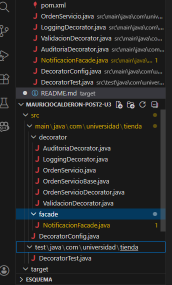
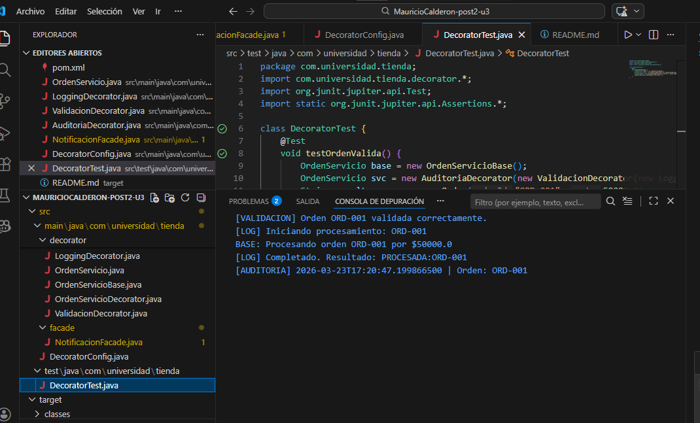
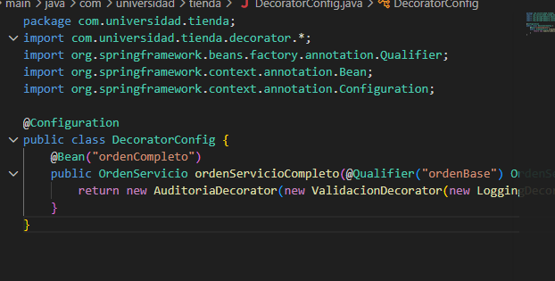

# Patrones Estructurales - Mauricio Calderón (Post-Contenido 2)

Este proyecto implementa los patrones de diseño **Decorator** y **Facade** utilizando **Java 17** y **Spring Boot**, como parte de la Unidad 3 de Ingeniería de Sistemas en la UDES[cite: 10, 11, 26].

##  Patrones Implementados

### 1. Patrón Decorator (Servicio de Órdenes)
Se aplicó para añadir capas de procesamiento a una orden de forma modular y dinámica sin alterar la lógica de la clase base (`OrdenServicioBase`)[cite: 30, 299].

**Estructura de la cadena configurada:**
- **AuditoriaDecorator**: Registra la fecha y hora de procesamiento].
- **ValidacionDecorator**: Verifica que el ID sea válido y el monto esté entre $1,000 y $50,000,000
- **LoggingDecorator**: Registra el inicio y fin del proceso en consola.
- **Componente Base**: Procesa la orden final[cite: 58].

### 2. Patron Facade (Subsistema de Notificaciones)
Se implementó `NotificacionFacade` para simplificar la interacción con tres servicios especializados: Email, SMS y Push. El cliente solo interactúa con la fachada, ocultando la complejidad del envío multicanal.

# Ejecutar las pruebas unitarias (JUnit 5)
mvn test

captures 
1) 
2) 
3) 
